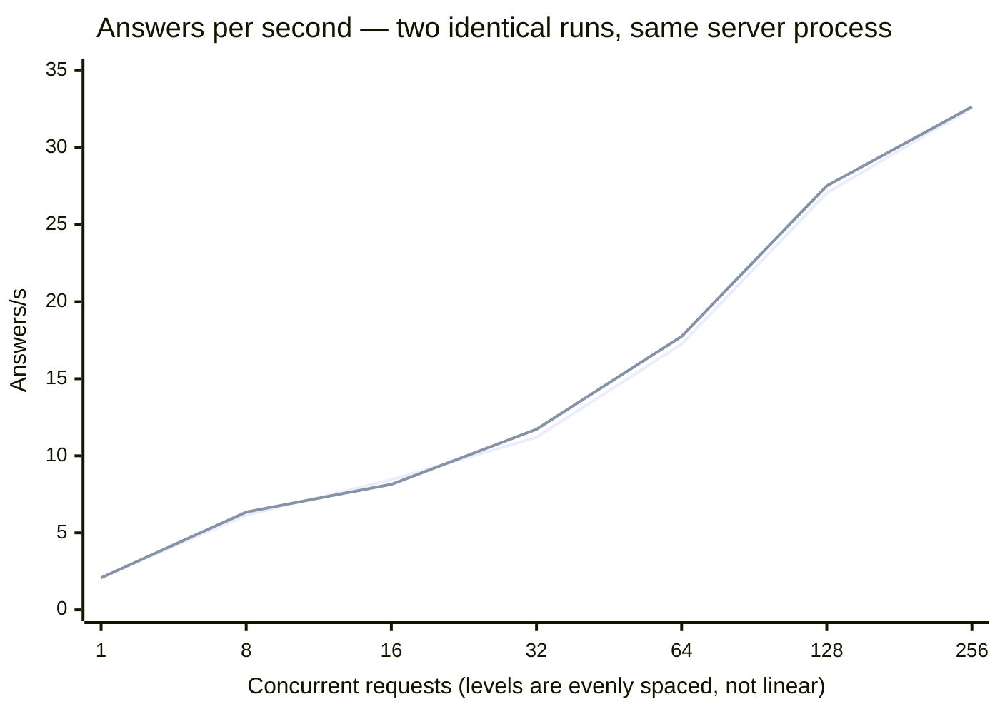
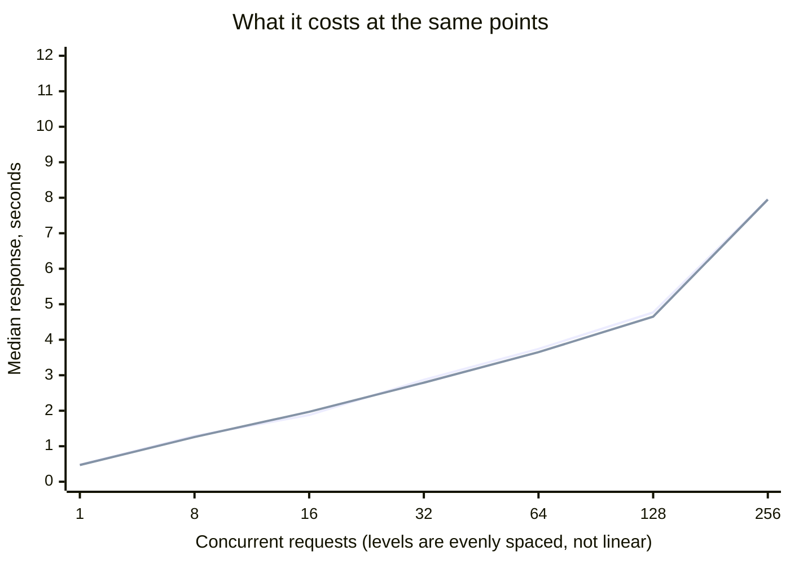
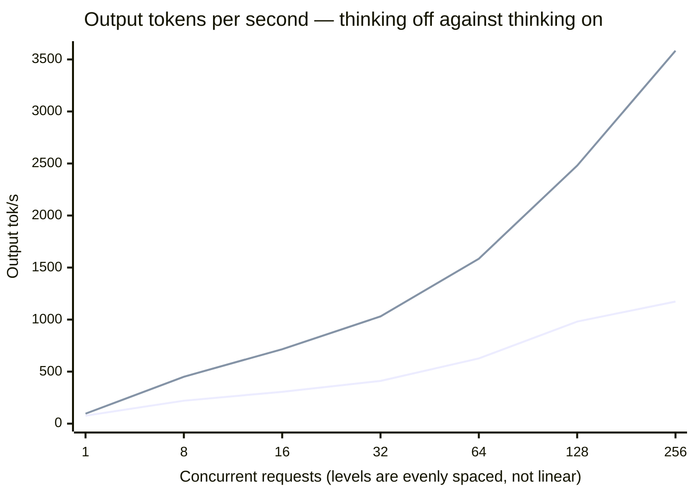

# Scenario: concurrent load — SGLang TP=2

The full concurrency sweep four times: twice at the protocol levels with thinking off,
once extended past 256, and once with thinking on.

**Setup:** [SGLang TP=2](../README.md) · `DeepSeek-V4-Flash-0731` ·
[cloudscale `GPU2-256-40-2-1600`](../../../README.md) · measured 2026-08-30 and 2026-09-22

## Method

Protocol `v1`, `--scenario concurrent`. FP8 KV cache without scaling factors throughout.
Runs 1 and 2 went back to back against the same server process on 2026-08-30; runs 3 and 4
against a freshly started server on 2026-09-22, same configuration.

| Run | Date | Levels | Thinking |
|---|---|---|---|
| 1, 2 | 2026-08-30 | protocol | off |
| 3 | 2026-09-22 | **`--levels 256,384,512`** | off |
| 4 | 2026-09-22 | protocol | **on** |

Two deviations, both recorded in their output headers. Run 3 overrides the levels to
reach past the protocol ceiling; every other parameter stays pinned. Run 4 sends
`chat_template_kwargs {"thinking": true}` on every request — thinking is **off** by
default in this setup, so this is the arm that has to be requested, not the other way
round. Its effect was verified against the token counts rather than assumed: answers grow
from 36 to 327 tokens, which an ignored key could not produce.

## Result

<!-- protocol v1 · max_tokens 512 · 40 s/level · 3 warmup requests discarded · counted via usage fields -->

**Run 1**

| Concurrent | Answers/s | Output tok/s | Total tok/s | Latency p50 | p95 | GPU |
|---|---|---|---|---|---|---|
| 1 | 2.08 | 76.1 | 2595.1 | 0.48 s | 0.57 s | 93 % · 90 % |
| 8 | 6.15 | 220.4 | 7686.5 | 1.29 s | 1.68 s | 91 % · 73 % |
| 16 | 8.45 | 306.0 | 10564.3 | 1.88 s | 2.56 s | 91 % · 73 % |
| 32 | 11.20 | 410.4 | 14007.2 | 2.87 s | 4.00 s | 92 % · 76 % |
| 64 | 17.25 | 626.7 | 21568.2 | 3.74 s | 5.21 s | 93 % · 85 % |
| 128 | 27.05 | 981.1 | 33819.8 | 4.77 s | 6.82 s | 97 % · 94 % |
| 256 | **32.58** | 1173.2 | 40719.2 | 7.96 s | 11.90 s | 99 % · 97 % |

**Run 2**

| Concurrent | Answers/s | Output tok/s | Total tok/s | Latency p50 | p95 | GPU |
|---|---|---|---|---|---|---|
| 1 | 2.08 | 76.5 | 2595.6 | 0.47 s | 0.59 s | 93 % · 85 % |
| 8 | 6.35 | 226.0 | 7934.9 | 1.26 s | 1.64 s | 92 % · 77 % |
| 16 | 8.15 | 293.9 | 10188.0 | 1.97 s | 2.67 s | 92 % · 75 % |
| 32 | 11.72 | 424.1 | 14658.3 | 2.79 s | 3.64 s | 91 % · 69 % |
| 64 | 17.75 | 640.0 | 22188.5 | 3.65 s | 4.83 s | 93 % · 84 % |
| 128 | 27.52 | 999.8 | 34415.1 | 4.65 s | 6.58 s | 98 % · 96 % |
| 256 | **32.65** | 1182.6 | 40819.7 | 7.95 s | 11.92 s | 96 % · 97 % |

**Prompt mix at concurrency 32**

| Run | Traffic | Answers/s | Output tok/s | Total tok/s | p50 | p95 |
|---|---|---|---|---|---|---|
| 1 | uniform | 11.85 | 426.6 | 14812.5 | 2.75 s | 3.66 s |
| 1 | mixed | 2.67 | 920.9 | 3336.5 | 15.22 s | 22.18 s |
| 2 | uniform | 11.70 | 424.7 | 14628.5 | 2.83 s | 3.62 s |
| 2 | mixed | 3.27 | 1134.0 | 3917.1 | 15.14 s | 18.69 s |

**Run 3 — past the protocol ceiling, thinking off**

<!-- protocol v1 · DEVIATION: levels 256,384,512 -->

| Concurrent | Answers/s | Output tok/s | Total tok/s | Latency p50 | p95 | GPU |
|---|---|---|---|---|---|---|
| 256 | 32.10 | 1159.9 | 40129.3 | 7.86 s | 12.65 s | 95 % · 94 % |
| 384 | 36.58 | 1331.6 | 45733.7 | 11.51 s | 16.25 s | 99 % · 98 % |
| 512 | **39.62** | **1436.5** | 49541.2 | 15.66 s | 19.63 s | 98 % · 98 % |

Mix at concurrency 32: uniform 11.70 answers/s · 425.2 output tok/s · p50 2.77 s;
mixed 3.25 · 1126.8 · 14.90 s.

**Run 4 — protocol levels, thinking on**

<!-- protocol v1 · chat_template_kwargs {"thinking": true} -->

| Concurrent | Answers/s | Output tok/s | Total tok/s | Latency p50 | p95 | GPU |
|---|---|---|---|---|---|---|
| 1 | 0.28 | 95.8 | 429.6 | 3.65 s | 4.51 s | 100 % · 99 % |
| 8 | 1.35 | 450.8 | 2089.7 | 6.16 s | 9.18 s | 97 % · 91 % |
| 16 | 2.23 | 715.3 | 3416.4 | 7.96 s | 12.52 s | 99 % · 92 % |
| 32 | 3.55 | 1030.8 | 5340.5 | 9.51 s | 14.00 s | 96 % · 91 % |
| 64 | 4.75 | 1584.7 | 7351.2 | 14.58 s | 24.80 s | 95 % · 92 % |
| 128 | 7.47 | 2479.2 | 11553.9 | 19.88 s | 31.55 s | 96 % · 93 % |
| 256 | 10.97 | **3583.8** | 16907.5 | 27.58 s | 46.19 s | 97 % · 95 % |

Mix at concurrency 32: uniform 3.52 answers/s · 1052.5 output tok/s · p50 10.08 s;
mixed 2.40 · 1206.2 · 15.66 s.

## Reading

**The protocol ceiling is not the machine's ceiling.** Run 3 reaches 39.62 answers/s and
1,436.5 output tok/s at 512 concurrent requests — 22 % and 24 % above the 256 figure that
three other documents quote as the peak — with both cards at 98 % and p50 still at 15.7 s.
The curve had not flattened when the sweep stopped. Everything above 512 is untested, and
the 256 column of this run reproduces August to within 1.7 % after 23 days.

**Thinking inverts the comparison.** Same model, same cards, same prompt: with thinking on
the server delivers **3× the output tokens per second** and **3× fewer answers**. Answers
grow from 36 to 327 tokens, a factor of 9.1, which matches the 8.75× measured on the
[four-card machine](../../../../cloudscale-gpu2-512-80-4-800/deepseek-v4-flash-0731/sglang/scenarios/reasoning-cost.md).

| At concurrency 256 | Thinking off | Thinking on |
|---|---|---|
| Answers/s | 32.58 | 10.97 |
| Output tok/s | 1,173.2 | **3,583.8** |
| Tokens per answer | 36 | 327 |
| Latency p50 | 7.96 s | 27.58 s |
| GPU | 99 % · 97 % | 97 % · 95 % |

Neither column is the model being faster or slower. Both are correct measurements of
different work, and **any table that ranks this setup against another has to state which
arm it used.** Ranked by tokens this setup leads the machine with thinking on and trails
with it off; ranked by answers it leads either way.

**The most reproducible ladder measured on this machine.**

| Concurrent | Run 1 | Run 2 | Spread |
|---|---|---|---|
| 1 | 2.08 | 2.08 | 0 % |
| 8 | 6.15 | 6.35 | 3 % |
| 16 | 8.45 | 8.15 | 4 % |
| 32 | 11.20 | 11.72 | 5 % |
| 64 | 17.25 | 17.75 | 3 % |
| 128 | 27.05 | 27.52 | 2 % |
| 256 | 32.58 | 32.65 | 0 % |

Worst case 5 %, against 17 % for [MiniMax-M2.5](../../../minimax-m2-5/vllm/scenarios/concurrent-load.md)
and 74 % at one level for the NVFP4 release on the older machine. Monotone throughout.

**Latency stays usable far longer than on any other model here.** p50 is still under 5 s
at concurrency 128, where MiniMax is at 34 s. Part of that is the 35-token answer length —
short answers finish sooner — and part is the engine.

**Mixed traffic is the least reproducible measurement**, 2.67 against 3.27 answers/s, a
22 % spread where every uniform level stays within 5 %. The opposite of MiniMax, where the
mix reproduced exactly. Do not read a single mixed row as a number.

**Neither card saturates.** 91–99 %, and the pair diverges by up to 22 points (91/69 % at
concurrency 32 in run 2). MiniMax held 100/100 at every level. Whether that gap is
recoverable was not investigated.

## Not measured

- **Levels above 512.** Run 3 stopped there and the curve was still rising at 98 % GPU.
  Where it turns over is unknown, and so is whether latency stays usable past 15.7 s p50.
- **Thinking on above 256, and a second run of either new arm.** Runs 3 and 4 are single
  measurements; runs 1 and 2 establish that this ladder reproduces to 5 %, which is
  weaker evidence than repeating them would be.
- **`reasoning_effort` between the two arms.** `v1` pins `low` in the
  [reasoning scenario](reasoning-cost.md) and offers no flag to vary it, so the middle of
  the range is unmeasured here.
