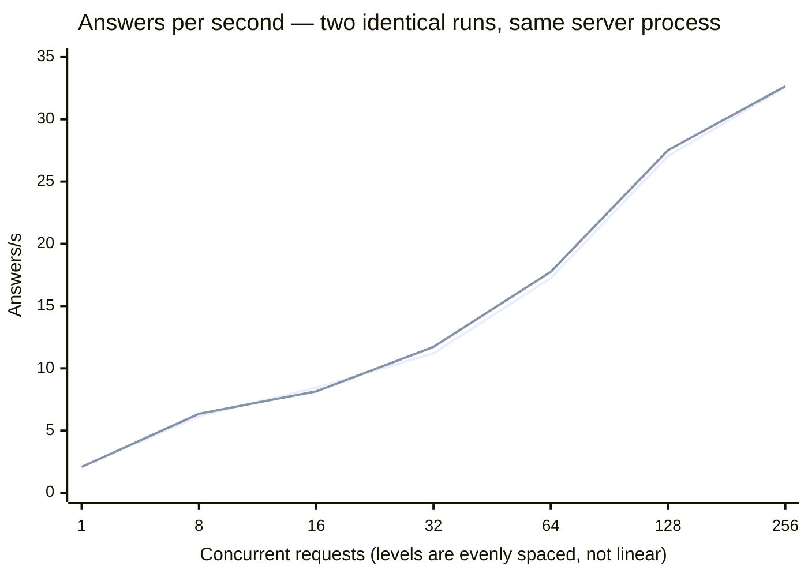
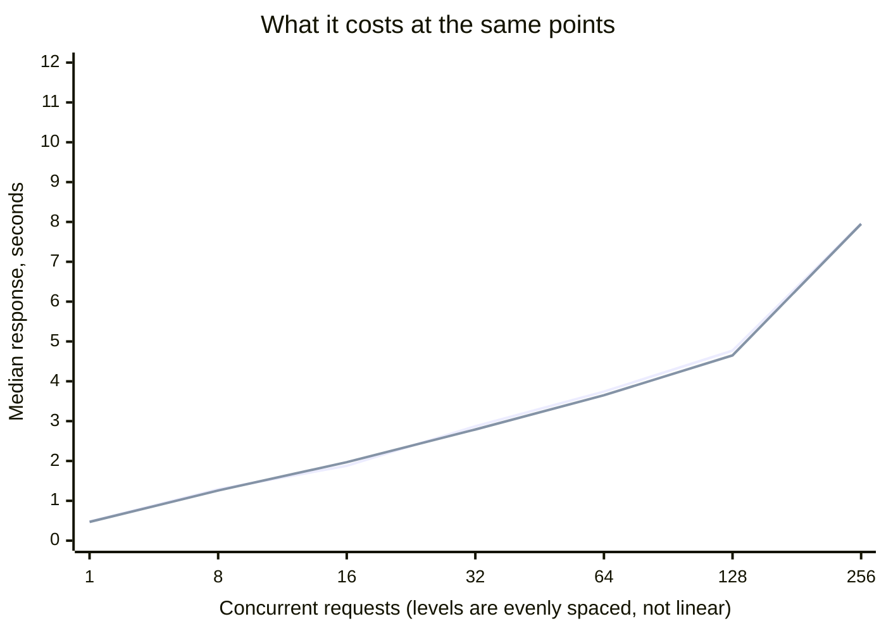

# Scenario: concurrent load — SGLang TP=2

The full concurrency sweep, twice, plus a mixed-traffic run.

**Setup:** [SGLang TP=2](../README.md) · `DeepSeek-V4-Flash-0731` ·
[cloudscale `GPU2-256-40-2-1600`](../../../README.md) · measured 2026-08-30

## Method

Protocol `v1`, `--scenario concurrent`, no deviations. Two runs back to back against the
same server process. **Thinking was off** — the default here, see
[reasoning cost](reasoning-cost.md). FP8 KV cache without scaling factors.

## Result

<!-- protocol v1 · max_tokens 512 · 40 s/level · 3 warmup requests discarded · counted via usage fields -->

**Run 1**

| Concurrent | Answers/s | Output tok/s | Total tok/s | Latency p50 | p95 | GPU |
|---|---|---|---|---|---|---|
| 1 | 2.08 | 76.1 | 2595.1 | 0.48 s | 0.57 s | 93 % · 90 % |
| 8 | 6.15 | 220.4 | 7686.5 | 1.29 s | 1.68 s | 91 % · 73 % |
| 16 | 8.45 | 306.0 | 10564.3 | 1.88 s | 2.56 s | 91 % · 73 % |
| 32 | 11.20 | 410.4 | 14007.2 | 2.87 s | 4.00 s | 92 % · 76 % |
| 64 | 17.25 | 626.7 | 21568.2 | 3.74 s | 5.21 s | 93 % · 85 % |
| 128 | 27.05 | 981.1 | 33819.8 | 4.77 s | 6.82 s | 97 % · 94 % |
| 256 | **32.58** | 1173.2 | 40719.2 | 7.96 s | 11.90 s | 99 % · 97 % |

**Run 2**

| Concurrent | Answers/s | Output tok/s | Total tok/s | Latency p50 | p95 | GPU |
|---|---|---|---|---|---|---|
| 1 | 2.08 | 76.5 | 2595.6 | 0.47 s | 0.59 s | 93 % · 85 % |
| 8 | 6.35 | 226.0 | 7934.9 | 1.26 s | 1.64 s | 92 % · 77 % |
| 16 | 8.15 | 293.9 | 10188.0 | 1.97 s | 2.67 s | 92 % · 75 % |
| 32 | 11.72 | 424.1 | 14658.3 | 2.79 s | 3.64 s | 91 % · 69 % |
| 64 | 17.75 | 640.0 | 22188.5 | 3.65 s | 4.83 s | 93 % · 84 % |
| 128 | 27.52 | 999.8 | 34415.1 | 4.65 s | 6.58 s | 98 % · 96 % |
| 256 | **32.65** | 1182.6 | 40819.7 | 7.95 s | 11.92 s | 96 % · 97 % |

**Prompt mix at concurrency 32**

| Run | Traffic | Answers/s | Output tok/s | Total tok/s | p50 | p95 |
|---|---|---|---|---|---|---|
| 1 | uniform | 11.85 | 426.6 | 14812.5 | 2.75 s | 3.66 s |
| 1 | mixed | 2.67 | 920.9 | 3336.5 | 15.22 s | 22.18 s |
| 2 | uniform | 11.70 | 424.7 | 14628.5 | 2.83 s | 3.62 s |
| 2 | mixed | 3.27 | 1134.0 | 3917.1 | 15.14 s | 18.69 s |

## Reading

**The most reproducible ladder measured on this machine.**

| Concurrent | Run 1 | Run 2 | Spread |
|---|---|---|---|
| 1 | 2.08 | 2.08 | 0 % |
| 8 | 6.15 | 6.35 | 3 % |
| 16 | 8.45 | 8.15 | 4 % |
| 32 | 11.20 | 11.72 | 5 % |
| 64 | 17.25 | 17.75 | 3 % |
| 128 | 27.05 | 27.52 | 2 % |
| 256 | 32.58 | 32.65 | 0 % |

Worst case 5 %, against 17 % for [MiniMax-M2.5](../../../minimax-m2-5/vllm/scenarios/concurrent-load.md)
and 74 % at one level for the NVFP4 release on the older machine. Monotone throughout.

**Latency stays usable far longer than on any other model here.** p50 is still under 5 s
at concurrency 128, where MiniMax is at 34 s. Part of that is the 35-token answer length —
short answers finish sooner — and part is the engine.

**Mixed traffic is the least reproducible measurement**, 2.67 against 3.27 answers/s, a
22 % spread where every uniform level stays within 5 %. The opposite of MiniMax, where the
mix reproduced exactly. Do not read a single mixed row as a number.

**Neither card saturates.** 91–99 %, and the pair diverges by up to 22 points (91/69 % at
concurrency 32 in run 2). MiniMax held 100/100 at every level. Whether that gap is
recoverable was not investigated.

## Not measured

- **Levels above 256.**
- **With thinking on.** [Reasoning cost](reasoning-cost.md) covers concurrency 8 and 32 only.
- **A third run.**
