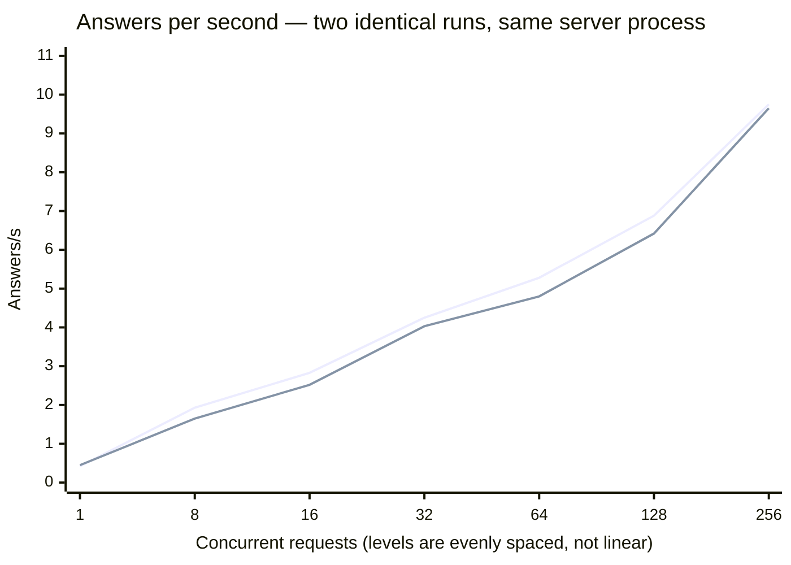
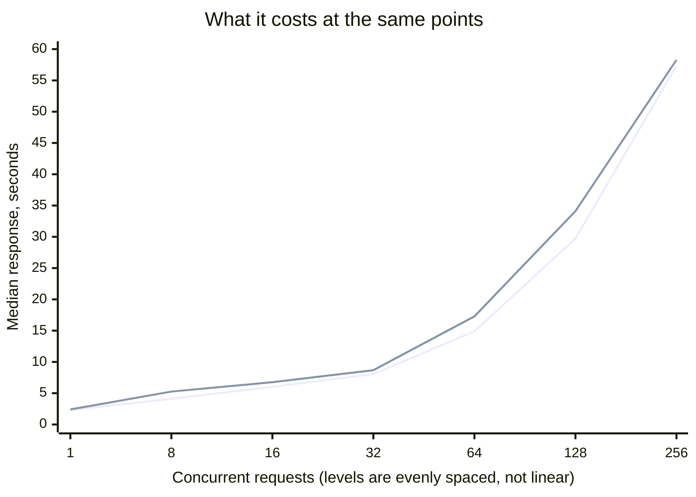

# Scenario: concurrent load — vLLM 0.28.0

The full concurrency sweep, twice, plus a mixed-traffic run.

**Setup:** [vLLM 0.28.0 TP=2](../README.md) · `nvidia/MiniMax-M2.5-NVFP4` ·
[cloudscale `GPU2-256-40-2-1600`](../../../README.md) · measured 2026-08-30

## Method

Protocol `v1`, `--scenario concurrent`, no deviations. Levels 1/8/16/32/64/128/256,
`max_tokens` 512, 40 s per level, 3 warmup requests discarded per level, counted via
`usage`. Server configured with `--max-num-seqs 32`, which the ladder deliberately runs
past.

**Two runs against the same server process**, back to back, with nothing else on the
cards. The second run exists because the
[NVFP4 run on the older machine](../../../../cloudscale-gpu2-512-80-4-800/deepseek-v4-flash-nvfp4/vllm-b12x/scenarios/concurrent-load.md)
swung 74 % between two identical runs at one level, and a single 40 s window on this
hardware class had therefore not earned trust.

## Result

<!-- protocol v1 · max_tokens 512 · 40 s/level · 3 warmup requests discarded · counted via usage fields -->

**Run 1**

| Concurrent | Answers/s | Output tok/s | Total tok/s | Latency p50 | p95 | GPU |
|---|---|---|---|---|---|---|
| 1 | 0.42 | 118.2 | 649.0 | 2.30 s | 3.65 s | 100 % · 100 % |
| 8 | 1.93 | 513.1 | 2917.4 | 4.12 s | 6.94 s | 100 % · 100 % |
| 16 | 2.83 | 804.2 | 4332.6 | 6.02 s | 9.90 s | 100 % · 100 % |
| 32 | 4.25 | 1247.1 | 6555.4 | 8.06 s | 13.04 s | 100 % · 100 % |
| 64 | 5.28 | 1492.6 | 8081.1 | 14.89 s | 20.15 s | 100 % · 100 % |
| 128 | 6.88 | 1942.9 | 10529.8 | 29.72 s | 36.70 s | 100 % · 100 % |
| 256 | **9.75** | **2947.3** | **15125.1** | 57.34 s | 72.49 s | 100 % · 100 % |

**Run 2**

| Concurrent | Answers/s | Output tok/s | Total tok/s | Latency p50 | p95 | GPU |
|---|---|---|---|---|---|---|
| 1 | 0.45 | 125.6 | 687.6 | 2.41 s | 3.26 s | 100 % · 100 % |
| 8 | 1.65 | 530.5 | 2591.3 | 5.26 s | 7.03 s | 100 % · 100 % |
| 16 | 2.52 | 818.1 | 3971.8 | 6.76 s | 9.63 s | 100 % · 100 % |
| 32 | 4.03 | 1283.8 | 6311.1 | 8.68 s | 12.47 s | 100 % · 100 % |
| 64 | 4.80 | 1525.4 | 7520.6 | 17.28 s | 21.84 s | 100 % · 100 % |
| 128 | 6.42 | 2081.2 | 10106.0 | 34.11 s | 39.66 s | 100 % · 100 % |
| 256 | **9.65** | **3125.5** | **15178.3** | 58.28 s | 75.68 s | 100 % · 100 % |

Two charts rather than one with two scales: a shared y-axis for answers per second and
seconds would put the trade on a single line and hide it.

**Prompt mix at concurrency 32**

| Run | Traffic | Answers/s | Output tok/s | Total tok/s | p50 | p95 |
|---|---|---|---|---|---|---|
| 1 | uniform | 4.33 | 1231.8 | 6633.8 | 7.76 s | 12.69 s |
| 1 | mixed | 2.40 | 1227.7 | 3100.9 | 16.53 s | 16.64 s |
| 2 | uniform | 3.98 | 1306.9 | 6271.7 | 9.03 s | 13.08 s |
| 2 | mixed | 2.40 | 1219.8 | 3093.1 | 16.62 s | 16.68 s |

## Reading

**The ladder is monotone in both runs.** Every level improves on the one below it, all
the way past `--max-num-seqs 32` to 256. The comparable NVFP4 run on the older machine
was **not** monotone — it dipped at exactly its own `--max-num-seqs` value.

**Run-to-run spread is small, and smallest where it matters.**

| Concurrent | Run 1 | Run 2 | Spread |
|---|---|---|---|
| 1 | 0.42 | 0.45 | 7 % |
| 8 | 1.93 | 1.65 | 17 % |
| 16 | 2.83 | 2.52 | 12 % |
| 32 | 4.25 | 4.03 | 5 % |
| 64 | 5.28 | 4.80 | 10 % |
| 128 | 6.88 | 6.42 | 7 % |
| **256** | **9.75** | **9.65** | **1 %** |

Worst case 17 % at concurrency 8; the peak reproduces to within 1 %. Against 74 % at one
level on the older stack, this is a different regime — and it is what makes the headline
number quotable. **Report the peak as 9.65–9.75 answers/s**, not as a single value.

**The mixed-traffic result reproduces exactly.** 2.40 answers/s in both runs, output
tok/s within 1 %. The uniform comparison at the same level moved 8 %, so the mix is the
more stable measurement of the two — the opposite of what one would guess.

**Mixed traffic halves answers per second but not output tokens.** 2.40 against ~4.15 at
the same concurrency, while output tok/s stays near 1230. The mix contains longer request
shapes, so each answer costs more; the machine delivers the same tokens into fewer,
larger answers. Total tok/s drops further because the reasoning share differs per shape.

**Both cards sit at 100 % at every level in both runs.** No divergence between the pair,
no unsaturated levels. On the older machine the same measurement peaked at 87 % with the
two cards up to a factor of two apart.

## Not measured

- **Levels above 256.**
- **Effect of `--max-num-seqs`.** Not swept; 32 was chosen, not derived.
- **A third run.** Two points bound a spread, they do not describe a distribution.
