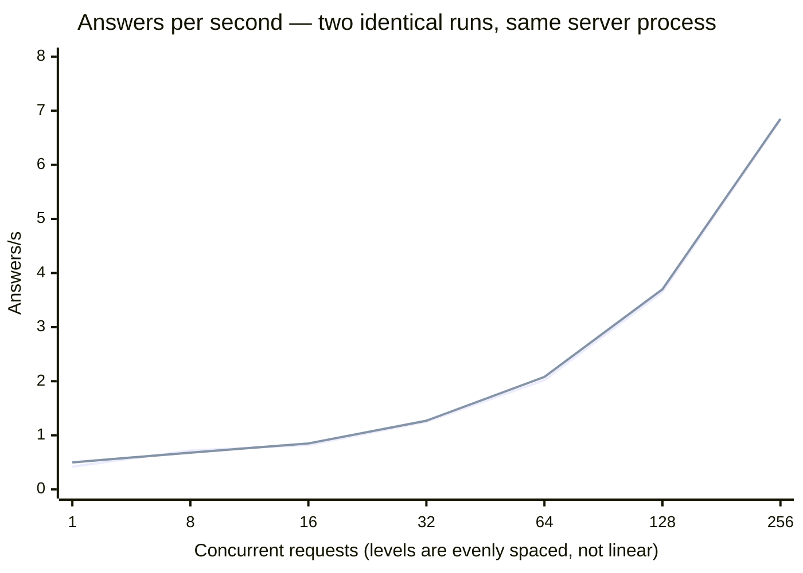
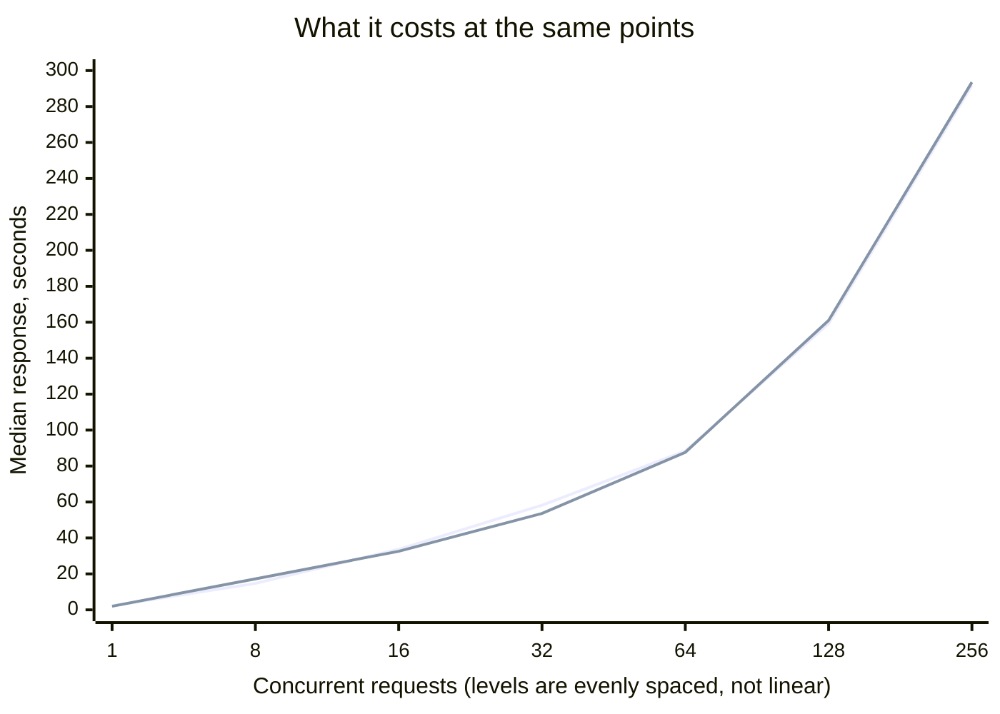

# Scenario: concurrent load — llama.cpp master

The full concurrency sweep, twice.

**Setup:** [llama.cpp `-sm layer`](../README.md) · `Qwen3.8-Flash-Next` UD-Q5_K_XL ·
[cloudscale `GPU2-256-40-2-1600`](../../../README.md) · measured 2026-08-31

## Method

Protocol `v1`, `--scenario concurrent`, no deviations. Two runs back to back against the
same server process, one slot, full 262,144 context. The
[`max_tokens` caveat](single-stream.md#method) applies here too.

## Result

<!-- protocol v1 · max_tokens 512 · 40 s/level · 3 warmup requests discarded · counted via usage fields -->

**Run 1**

| Concurrent | Answers/s | Output tok/s | Total tok/s | Latency p50 | p95 | GPU |
|---|---|---|---|---|---|---|
| 1 | 0.42 | 89.7 | 626.5 | 2.21 s | 3.75 s | 45 % · 45 % |
| 8 | 0.72 | 121.0 | 1036.7 | 14.70 s | 16.36 s | 46 % · 45 % |
| 16 | 0.82 | 163.2 | 1205.2 | 33.70 s | 36.81 s | 46 % · 45 % |
| 32 | 1.25 | 246.6 | 1825.4 | 58.19 s | 72.59 s | 45 % · 45 % |
| 64 | 2.02 | 396.0 | 2953.6 | 88.36 s | 141.32 s | 46 % · 45 % |
| 128 | 3.65 | 691.5 | 5301.5 | 159.22 s | 272.83 s | 45 % · 44 % |
| 256 | 6.83 | 1301.8 | 9921.8 | 291.82 s | 548.00 s | 46 % · 45 % |

**Run 2**

| Concurrent | Answers/s | Output tok/s | Total tok/s | Latency p50 | p95 | GPU |
|---|---|---|---|---|---|---|
| 1 | 0.50 | 89.8 | 721.4 | 1.99 s | 2.67 s | 45 % · 44 % |
| 8 | 0.68 | 128.1 | 980.6 | 17.22 s | 17.99 s | 45 % · 45 % |
| 16 | 0.85 | 158.2 | 1231.7 | 32.59 s | 34.30 s | 46 % · 45 % |
| 32 | 1.27 | 240.2 | 1850.5 | 53.64 s | 68.87 s | 47 % · 45 % |
| 64 | 2.08 | 391.6 | 3012.3 | 87.62 s | 135.67 s | 46 % · 44 % |
| 128 | 3.70 | 710.8 | 5383.9 | 161.00 s | 277.27 s | 46 % · 45 % |
| 256 | 6.85 | 1297.6 | 9949.2 | 293.53 s | 539.76 s | 45 % · 45 % |

**Prompt mix at concurrency 32**

| Run | Traffic | Answers/s | Output tok/s | Total tok/s | p50 | p95 |
|---|---|---|---|---|---|---|
| 1 | uniform | 1.20 | 241.7 | 1757.3 | 56.34 s | 71.85 s |
| 1 | mixed | 0.97 | 454.8 | 1076.2 | 105.24 s | 174.78 s |
| 2 | uniform | 1.25 | 231.7 | 1810.4 | 55.27 s | 68.45 s |
| 2 | mixed | 0.97 | 463.2 | 1254.5 | 102.98 s | 174.05 s |

## Reading

**GPU utilisation is 45 % at every level of both runs.** One card computes while the other
waits, all the way from a single request to 256. This is the whole story of this table:
half the machine is idle, and no amount of load changes it, because `-sm row`
[does not load on these cards](../../../README.md#llamacpp-cannot-split-across-these-cards).

**Latency is where it hurts, not throughput.** p50 crosses 14 s at concurrency 8, a minute
at 32, and reaches 291.8 s at 256 with a p95 of 548 s.
[DeepSeek-0731](../../../deepseek-v4-flash-0731/sglang/scenarios/concurrent-load.md) is at
2.87 s and 7.96 s at those points. For a single interactive user the difference is 2.2 s
against 0.48 s; under agent load it is nine minutes against eight seconds.

**Reproducibility is excellent — 2 % at the top and 5 % across the ladder.** A saturated,
predictable, half-idle machine.

**The mix costs less here than elsewhere.** 0.97 against ~1.22 answers/s, while output
tokens per second nearly double. With the engine as the bottleneck, longer requests are
comparatively cheap.

## Not measured

- **Levels above 256.**
- **More than one slot.** `--parallel 1` held the full context; splitting it may trade
  latency for throughput.
