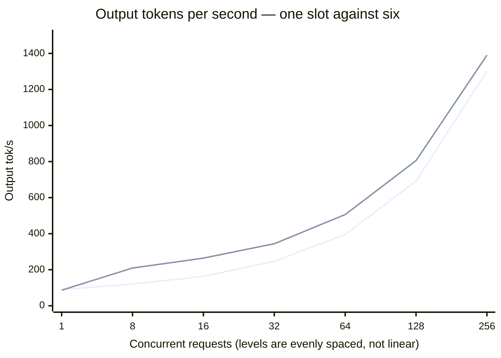
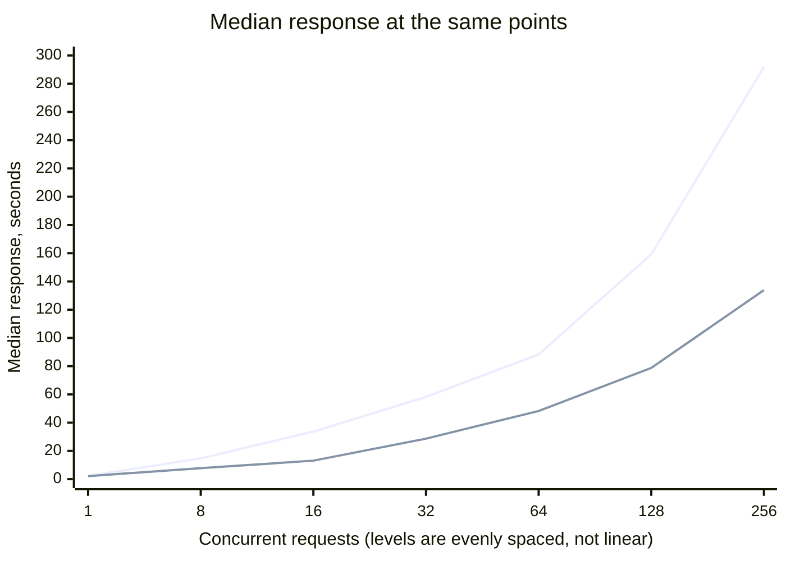

# Scenario: concurrent load — llama.cpp master

The full concurrency sweep on two configurations, plus a slot sweep between them.

**Setup:** [llama.cpp `-sm layer`](../README.md) ·
[cloudscale `GPU2-256-40-2-1600`](../../../README.md)

| | Quantisation | `--parallel` | Context per slot | Measured |
|---|---|---|---|---|
| **A** | UD-Q5_K_XL | 1 | 262,144 | 2026-08-31, twice |
| **B** | UD-Q6_K_XL | 6 | 262,144 | 2026-09-21 |

## Method

Protocol `v1`, `--scenario concurrent`, no deviations, for the two full ladders. Both A
runs went back to back against the same server process. The
[`max_tokens` caveat](single-stream.md#method) applies throughout.

The slot sweep further down deviates: `--levels 1,4,8,16`, chosen to bracket the slot
count. Every other parameter is pinned. The deviation is recorded in each output header.

## Result — configuration A, one slot

<!-- protocol v1 · max_tokens 512 · 40 s/level · 3 warmup requests discarded · counted via usage fields -->

**Run 1**

| Concurrent | Answers/s | Output tok/s | Total tok/s | Latency p50 | p95 | GPU |
|---|---|---|---|---|---|---|
| 1 | 0.42 | 89.7 | 626.5 | 2.21 s | 3.75 s | 45 % · 45 % |
| 8 | 0.72 | 121.0 | 1036.7 | 14.70 s | 16.36 s | 46 % · 45 % |
| 16 | 0.82 | 163.2 | 1205.2 | 33.70 s | 36.81 s | 46 % · 45 % |
| 32 | 1.25 | 246.6 | 1825.4 | 58.19 s | 72.59 s | 45 % · 45 % |
| 64 | 2.02 | 396.0 | 2953.6 | 88.36 s | 141.32 s | 46 % · 45 % |
| 128 | 3.65 | 691.5 | 5301.5 | 159.22 s | 272.83 s | 45 % · 44 % |
| 256 | 6.83 | 1301.8 | 9921.8 | 291.82 s | 548.00 s | 46 % · 45 % |

**Run 2**

| Concurrent | Answers/s | Output tok/s | Total tok/s | Latency p50 | p95 | GPU |
|---|---|---|---|---|---|---|
| 1 | 0.50 | 89.8 | 721.4 | 1.99 s | 2.67 s | 45 % · 44 % |
| 8 | 0.68 | 128.1 | 980.6 | 17.22 s | 17.99 s | 45 % · 45 % |
| 16 | 0.85 | 158.2 | 1231.7 | 32.59 s | 34.30 s | 46 % · 45 % |
| 32 | 1.27 | 240.2 | 1850.5 | 53.64 s | 68.87 s | 47 % · 45 % |
| 64 | 2.08 | 391.6 | 3012.3 | 87.62 s | 135.67 s | 46 % · 44 % |
| 128 | 3.70 | 710.8 | 5383.9 | 161.00 s | 277.27 s | 46 % · 45 % |
| 256 | 6.85 | 1297.6 | 9949.2 | 293.53 s | 539.76 s | 45 % · 45 % |

**Prompt mix at concurrency 32**

| Run | Traffic | Answers/s | Output tok/s | Total tok/s | p50 | p95 |
|---|---|---|---|---|---|---|
| 1 | uniform | 1.20 | 241.7 | 1757.3 | 56.34 s | 71.85 s |
| 1 | mixed | 0.97 | 454.8 | 1076.2 | 105.24 s | 174.78 s |
| 2 | uniform | 1.25 | 231.7 | 1810.4 | 55.27 s | 68.45 s |
| 2 | mixed | 0.97 | 463.2 | 1254.5 | 102.98 s | 174.05 s |

## Result — configuration B, six slots

<!-- protocol v1 · max_tokens 512 · 40 s/level · 3 warmup requests discarded · counted via usage fields -->

| Concurrent | Answers/s | Output tok/s | Total tok/s | Latency p50 | p95 | GPU |
|---|---|---|---|---|---|---|
| 1 | 0.47 | 86.5 | 686.5 | 2.15 s | 2.73 s | 43 % · 42 % |
| 8 | 1.10 | 209.4 | 1598.7 | 7.77 s | 10.48 s | 39 % · 39 % |
| 16 | 1.50 | 264.4 | 2158.8 | 13.10 s | 15.46 s | 42 % · 40 % |
| 32 | 1.77 | 344.3 | 2586.1 | 28.68 s | 31.95 s | 43 % · 39 % |
| 64 | 2.73 | 505.9 | 3947.6 | 48.29 s | 58.71 s | 42 % · 41 % |
| 128 | 4.22 | 805.2 | 6141.4 | 78.76 s | 117.83 s | 43 % · 40 % |
| 256 | **7.47** | **1390.3** | 10831.2 | 133.88 s | 226.67 s | 42 % · 40 % |

**Prompt mix at concurrency 32**

| Traffic | Answers/s | Output tok/s | Total tok/s | p50 | p95 |
|---|---|---|---|---|---|
| uniform | 1.88 | 339.5 | 2707.6 | 26.05 s | 30.14 s |
| mixed | 1.15 | 536.2 | 1459.0 | 65.16 s | 90.72 s |

## A against B

Against run 1 of A, at the same levels:

| Concurrent | Output tok/s | Latency p50 |
|---|---|---|
| 1 | −3.6 % | −2.7 % |
| 8 | **+73.1 %** | **−47.1 %** |
| 16 | **+62.0 %** | **−61.1 %** |
| 32 | +39.6 % | −50.7 % |
| 64 | +27.8 % | −45.4 % |
| 128 | +16.4 % | −50.5 % |
| 256 | +6.8 % | −54.1 % |

## Slot sweep

Same checkpoint (Q6_K_XL), same server build, only `--parallel` and the matching `-c`
changed so that every slot keeps the full 262,144. Deviation: `--levels 1,4,8,16`.

| Concurrent | 4 slots · tok/s | 6 slots · tok/s | 4 slots · p50 | 6 slots · p50 |
|---|---|---|---|---|
| 1 | 88.5 | 92.0 | 1.93 s | 2.12 s |
| 4 | 183.3 | 179.9 | 3.99 s | 4.29 s |
| 8 | 210.0 | 236.2 | 7.78 s | 6.93 s |
| 16 | **175.0** | **269.0** | **21.03 s** | **14.19 s** |

**Four slots turn over at 16 concurrent requests**: throughput falls from 210.0 to 175.0
and p50 nearly triples. Six slots keep climbing through the same point. The dip is the
slot count, not a throughput ceiling — which is why the level was worth measuring above
the slot count rather than only at it.

## Reading

**`--parallel` does not raise the ceiling. It decides how fast you reach it.** One slot
and six converge at the top of the ladder: 1,301.8 against 1,390.3 output tok/s at 256
concurrent requests, 6.8 % apart. Below that the gap is large — 73 % at eight concurrent
— and it narrows monotonically as load grows. The engine saturates at roughly
1,400 output tok/s either way.

**Latency is the column that improves everywhere.** Around −50 % at every level from 8
upward, and it does not decay with load the way the throughput advantage does. For
interactive and agent use this is the whole value of the change: p50 at eight concurrent
requests goes from 14.70 s to 7.77 s, and at sixteen from 33.70 s to 13.10 s.

**GPU utilisation did not move, and slightly fell.** 45–46 % on A, 39–43 % on B. Six
slots extract more work from the same half-idle machine without touching the idle half.
That is consistent with the cause being `-sm row`
[not loading on these cards](../../../README.md#llamacpp-cannot-split-across-these-cards):
more concurrency cannot recruit a card the engine will not use.

**Reproducibility on A is excellent** — 2 % at the top and 5 % across the ladder. B was
run once; its slot sweep at levels 1–16 reproduced the full ladder's shape at those
points to within 12 %, which is weaker evidence than two full runs.

**The mix stays cheaper than uniform traffic.** On B, 1.15 against 1.88 answers/s while
output tokens per second rise from 339.5 to 536.2. Same effect as on A: with the engine
as the bottleneck, longer requests are comparatively cheap.

## Not measured

- **Levels above 256.**
- **A second run of configuration B.** The variance figure quoted above is from A.
- **Slot counts above 6.** At Q6 the KV pool for a seventh slot no longer fits beside
  the weights; at a lower quantisation it would.
- **Whether the ceiling is the scheduler or the layer split.** Both ladders flatten near
  1,400 output tok/s at ~42 % GPU. Separating the two would need a configuration where
  the cards work simultaneously, which `-sm row` does not permit here.
