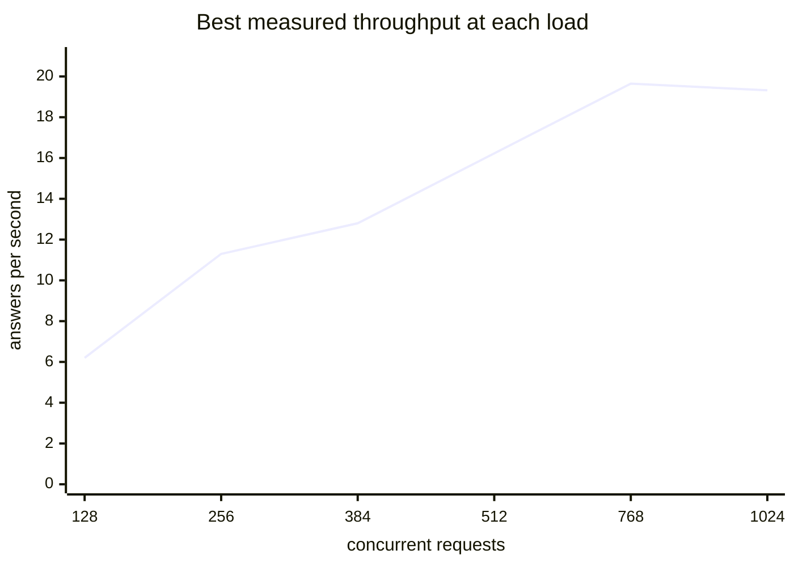
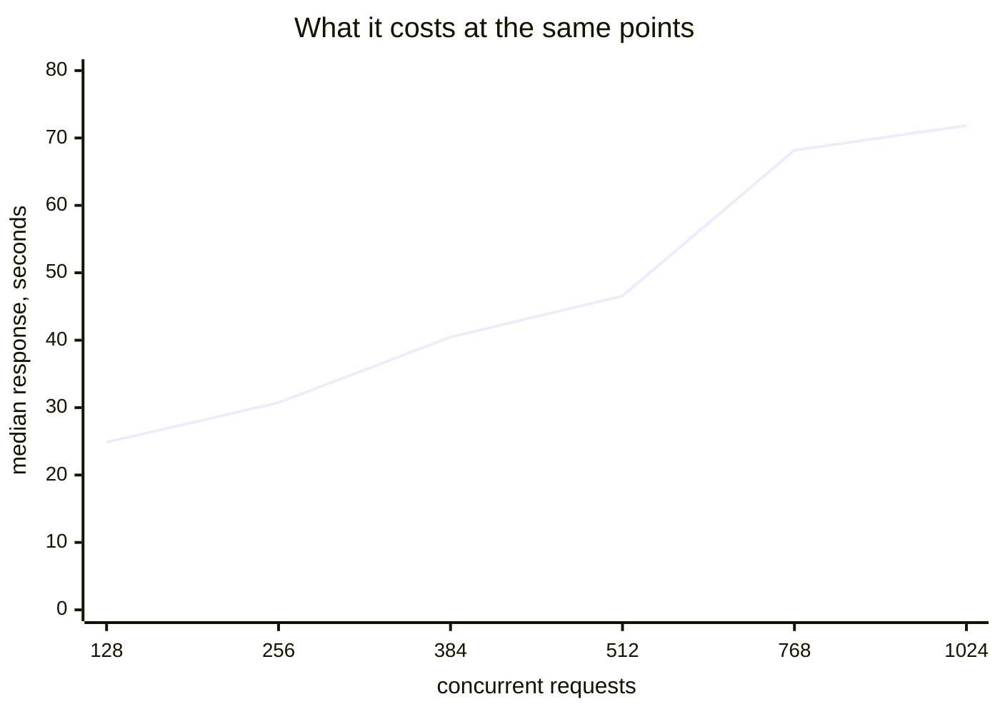

# Scenario: concurrent load — SGLang

Concurrency sweep from 1 to 256 parallel requests: how throughput, latency and GPU
utilisation develop under load, and what a non-uniform prompt mix costs.

**Setup:** [SGLang + SM120 patchset](../README.md) · DeepSeek-V4-Flash-0731 ·
[cloudscale `GPU2-512-80-4-800`](../../../README.md) · measured 2026-08-14/15

## Method

Prompt ~1000 tokens, `max_tokens` 512, 40 s per concurrency level, token counts from
the `usage` fields, GPU utilisation sampled per card throughout. The TTFT table below
comes from a separate run with shorter output — there what matters is how quickly the
first answer begins, not how much is produced.

The levels above 128 were measured in a later run; they use the same prompt and method
but sample GPU utilisation as a single mean across all four cards.

## Throughput

> **Pre-`v1` series.** The table below was measured with a German prompt, before the
> measurement protocol was pinned. Against the `v1` numbers in
> [configuration sweep](#configuration-sweep-protocol-v1) below, only **requests per
> second and TTFT are comparable** — token counts are not, because reasoning length
> depends on the prompt. Re-measured under `v1` on 2026-08-16, this configuration gives
> 11.30 req/s at concurrency 256 against the 11.12 recorded here, while total tok/s
> differs by roughly a third.

| Concurrent | Output tok/s | Total tok/s | Req/s | Latency p50 | GPU |
|---|---|---|---|---|---|
| 1 | 131.2 | 665.2 | 0.28 | 3.81 s | 92 · 92 · 92 · 91 % |
| 8 | 631.0 | 3155.7 | 1.30 | 6.58 s | 93 · 92 · 93 · 93 % |
| 16 | 986.1 | 4918.6 | 2.02 | 8.67 s | 90 · 93 · 91 · 94 % |
| 32 | 1571.4 | 7785.8 | 3.20 | 11.81 s | 92 · 93 · 92 · 93 % |
| 64 | 2276.4 | 11258.2 | 4.62 | 17.56 s | 93 · 93 · 92 · 93 % |
| 128 | 2956.0 | 14656.5 | 6.03 | 29.82 s | 91 · 95 · 92 · 94 % |
| 192 | 4287.5 | 21425.6 | 8.82 | 27.70 s | 97 % |
| 256 | **5420.7** | **27025.5** | **11.12** | 31.15 s | 97 % |

The second run repeated concurrency 128 and measured 3138.2 output tok/s against
2956.0 in the first — about 6 % run-to-run variation at this level.

## Prompt mix

The sweep above uses one prompt shape repeatedly. Real agent traffic does not. This
run mixes five shapes at concurrency 32 — a short factual question, a code review, a
long analysis (~4500 tokens), a tool-call formulation, and mid-length prose — drawn at
random per request.

| Traffic | Answers/s | Output tok/s | Total tok/s | Latency p50 | p95 |
|---|---|---|---|---|---|
| uniform | 3.12 | 1535.2 | 7603.9 | 11.94 s | 13.91 s |
| **mixed** | **2.52** | 1292.8 | 5026.3 | 13.95 s | 17.00 s |
| mixed, thinking off | 2.95 | 1292.1 | 5899.8 | 12.62 s | 16.60 s |

## Latency under load

Shorter output, same concurrency levels.

| Concurrent | Req/s | TTFT p50 | TTFT p95 |
|---|---|---|---|
| 1 | 0.62 | 0.15 s | 0.15 s |
| 8 | 2.12 | 0.18 s | 2.09 s |
| 16 | 3.83 | 0.20 s | 0.62 s |
| 32 | 5.55 | 0.25 s | 0.62 s |
| 64 | 7.95 | **0.32 s** | 0.97 s |

## GPU utilisation at 32 concurrent requests

Against [llama.cpp](../../llama-cpp/scenarios/concurrent-load.md) on the same hardware
with the same weights:

```
SGLang     GPU0 ████████████████████░  92 %
           GPU1 ████████████████████░  93 %
           GPU2 ████████████████████░  92 %
           GPU3 ████████████████████░  93 %

llama.cpp  GPU0 ████░░░░░░░░░░░░░░░░░  22 %
           GPU1 ████░░░░░░░░░░░░░░░░░  19 %
           GPU2 ████░░░░░░░░░░░░░░░░░  19 %
           GPU3 ████░░░░░░░░░░░░░░░░░  20 %
```

llama.cpp distributes layers across cards and works through them sequentially; SGLang
distributes tensors and has all four compute at once.

## Configuration sweep (protocol `v1`)

Measured 2026-08-16 to answer whether concurrency 256 was a ceiling or just the
configured limit. Two server flags were varied; everything else stayed at the values in
the [setup README](../README.md#configuration-in-effect).

**Method deviation:** `bench.py --levels` overrides the pinned level list per run
(`256,384,512` etc.). Every other protocol parameter — `max_tokens` 512, 40 s per level,
3 discarded warmups, `usage` counting, the verbatim English prompt — is unchanged, and
each run records the deviation in its own output header. The Infinity embedding
container was stopped for every run so all four cards had symmetric free memory.

| `max-running-requests` | `cuda-graph-max-bs` | Concurrent | Req/s | Output tok/s | Total tok/s | p50 | GPU |
|---|---|---|---|---|---|---|---|
| 256 | 64 | 128 | 6.20 | 2106.2 | 9633.0 | 24.86 s | 81 · 88 · 77 · 75 % |
| 256 | 64 | 256 | 11.30 | 3748.1 | 17466.3 | 30.74 s | 95 · 97 · 97 · 96 % |
| 512 | 64 | 256 | 9.05 | 2989.0 | 13975.7 | 37.35 s | 75 · 89 · 76 · 82 % |
| 512 | 64 | 384 | 12.80 | 4154.9 | 19694.2 | 40.46 s | 96 · 97 · 97 · 97 % |
| 512 | 64 | 512 | 16.23 | 5254.4 | 24951.6 | 46.56 s | 96 · 97 · 98 · 98 % |
| 512 | 128 | 256 | 8.18 | 2679.8 | 12604.2 | 42.48 s | 85 · 87 · 81 · 80 % |
| 512 | 128 | 384 | 11.72 | 3820.0 | 18054.2 | 44.53 s | 98 · 97 · 96 · 96 % |
| 512 | 128 | 512 | 15.45 | 4946.6 | 23702.9 | 50.44 s | 97 · 98 · 98 · 98 % |
| 1024 | 64 | 512 | 13.07 | 4330.9 | 20204.0 | 62.70 s | 80 · 89 · 81 · 77 % |
| **1024** | **64** | **768** | **19.65** | **6453.6** | **30308.7** | 68.20 s | 96 · 96 · 98 · 98 % |
| 1024 | 64 | 1024 | 19.32 | 6015.2 | 29475.8 | 71.84 s | 99 · 79 · 98 · 98 % |
| 768 | 64 | 640 | 10.45 | 3097.7 | 15784.0 | 66.21 s | 91 · 82 · 91 · 91 % |
| 768 | 64 | 768 | **crashed** | | | | |
| 768 | 64 | 896 | **crashed** | | | | |

Each cell is a single 40 s window. The 6 % run-to-run spread measured at concurrency 128
applies here too, so 19.65 against 19.32 does not establish 768 as the exact optimum —
only that the curve turns somewhere between 768 and 1024.

### The flags trade against the same memory

Graph capture happens **outside** `mem-fraction-static`: the log reports available
memory before and after. Raising the request ceiling shrinks the KV pool, because
per-request bookkeeping is reserved up front.

| `max-running-requests` | per DP rank | `max_total_num_tokens` |
|---|---|---|
| 256 | 64 | 2,799,872 |
| 512 | 128 | 2,688,000 |
| 768 | 192 | 2,576,384 |
| 1024 | 256 | 2,464,512 |

At `cuda-graph-max-bs 128` the draft-verify graph alone costs 1.57 GB per rank against
0.82 GB at 64, leaving 7.02 GB free instead of 9.83 GB.

### `max-running-requests 768` crashes the scheduler

Not a tuning result — a hard failure:

```
Error: Failed to initialize the TMA descriptor 1
[DP1 TP1 EP1] Scheduler hit an exception:
tvm.error.InternalError: Failed at
  /sgl-workspace/sglang/python/sglang/jit_kernel/csrc/gemm/fp8_blockwise/fp8_blockwise_scaled_mm_sm120.cuh:426
Subprocess scheduler_0 (pid=231) crashed with exit code -3
```

192 running requests per rank breaks the SM120 FP8 blockwise GEMM. **256 per rank
(`max-running-requests 1024`) does not**, so this is a specific broken size, not a
monotonic limit. The container restarted itself; the level before the crash (640) was
already degraded.

## Reading

**Throughput keeps scaling to 256 — the curve does not flatten.** From 128 to 256 both
output and total tokens rise by 73 %, and answers per second nearly double. This
contradicts the reference recipe for this image, which reports throughput regressing
beyond concurrency 128.

**And it keeps scaling past 256 — the limit was the configuration, not the hardware.**
The [configuration sweep](#configuration-sweep-protocol-v1) reaches **19.65 req/s at
concurrency 768** with `max-running-requests 1024`, against 11.30 for the shipped
configuration at its own best level — **74 % more answers per second on the same cards**.
The turning point lies between 768 and 1024.

**But the ceiling is a three-way trade, not a number.** Raising the request ceiling
shrinks the KV pool; raising the graph budget shrinks it further; and a ceiling that the
load does not fill costs throughput rather than adding it — `max-running-requests 1024`
at concurrency 512 is worse than `512` at the same level (13.07 against 16.23 req/s).
A larger `cuda-graph-max-bs` loses on every level measured.

**The shipped configuration is not the throughput optimum, and it is not obviously the
wrong choice either.** At concurrency 768 the median response time is 68 s. That is
batch territory; for interactive use the usable range stays where it was. Changing it
would also mean living next to a configuration that hard-crashes, which is an argument
for measuring stability before chasing the peak.

**Latency is what breaks first, not throughput.** p95 doubles from 32.70 s at 128 to
53.59 s at 256 while p50 barely moves — the tail stretches rather than the median. For
interactive use the usable range remains 32 to 64; the levels above that are batch
territory.

**TTFT stays flat where it matters.** Even at 64 concurrent requests the first token
arrives after 0.32 s. The queue shows up in total response time, not in time to first
token — the opposite of the llama.cpp behaviour, where TTFT jumps to 13.71 s once the
slots are full.

**Utilisation is constant at 90–97 %.** The cards are saturated at every level,
including concurrency 1, so the throughput gain across the sweep comes from better
batching rather than from idle capacity being filled.

**A realistic prompt mix costs about 19 %.** Answers per second drop from 3.12 to 2.52
and p95 latency rises by 22 % when request shapes vary. The synthetic sweep therefore
flatters the numbers — but moderately, not dramatically. Total tokens per second fall
further (−34 %) than output tokens (−16 %), because the mix contains shorter prompts;
that spread is an artefact of the mix, not a performance signal.

## Choosing a configuration for a workload

How far the machine carries, if it is configured for the load it actually gets. Each
point is the best value any measured configuration reached at that level; which one it
was is in the table below.





Two charts rather than one with two scales: a shared y-axis for answers per second and
seconds would put the trade on a single line and hide it. The x-axis is linear and
starts at 128 — Mermaid has no logarithmic scale
([#5438](https://github.com/mermaid-js/mermaid/issues/5438)), and no syntax for gaps in a
series, which is why the three configurations cannot share one chart: each covers a
different slice of the range.

Each configuration at its own best level — the number it reaches when the load actually
fills its ceiling:

```
req/s          0                    20      median response

cap 256   ship ███████████░░░░░░░░░░  11.30      31 s   at 256 concurrent
cap 512        ████████████████░░░░░  16.23      47 s   at 512 concurrent
cap 1024       ████████████████████░  19.65      68 s   at 768 concurrent
```

Throughput and response time move together, so the choice is a workload question, not a
better/worse question:

| Offered load | Configuration | Why |
|---|---|---|
| up to ~64 | **shipped** | Cards already sit at 92 % utilisation and responses take 4–18 s. A higher ceiling changes nothing here except shrinking the KV pool |
| 64 – 256 | **shipped** | At 256 the shipped ceiling gives 11.30 req/s against 9.05 for `cap 512`. A ceiling the load does not fill costs throughput |
| 256 – 512 | `--max-running-requests 512` | 16.23 req/s, but median response time rises to 47 s |
| 512 – 1024 | `--max-running-requests 1024` | 19.65 req/s at concurrency 768, the best measured value. The curve turns between 768 and 1024 |
| — | **never `768`** | [Crashes the scheduler](#max-running-requests-768-crashes-the-scheduler) |

`--cuda-graph-max-bs` stays at 64 in every row: 128 loses on every level measured.

### Translating users into concurrency

**This part is arithmetic, not measurement.** The benchmark knows concurrent requests, not
people. The conversion is written out so it can be corrected against a real deployment:

```
concurrent requests ≈ users × (response time ÷ time between their requests)
```

A person in a chat who asks something every 60 s and waits 12 s for the answer produces
0.2 concurrent requests. **Fifty such users land near 10** — a factor of 25 below the
first band. Agents change the picture: a loop with no thinking pause counts as a full
request, so 30 parallel agent runs are 30.

The practical consequence: **human users do not reach the ceiling.** It starts to matter
when batch work arrives — indexing a corpus, an offline evaluation, overnight processing.
Until then the shipped configuration is not a compromise, it is the right band.

## Not measured

- Repeat measurements at the peak. Every cell of the configuration sweep is a single
  40 s window, and 19.65 against 19.32 sits inside the known 6 % spread — the optimum is
  "between 768 and 1024", not 768
- Stability of `max-running-requests 1024` under sustained load. It completed every
  sweep level, but its neighbour at 768 crashes the scheduler outright, so a config
  change would need a long run before anyone trusts it
- Whether the `768` crash is specific to 192 requests per rank or to some other property
  of that size. Only 64, 128, 192 and 256 per rank were tried, and only 192 failed
- Draft acceptance under the mixed traffic — the mix was measured end to end, but
  per-request acceptance was not recorded, so the assumed link between prompt
  uniformity and acceptance remains untested
- Sustained load beyond 40 s per level, which is where memory pressure and cache
  eviction would appear

The effect of thinking on cost per answer is measured separately in
[reasoning-cost.md](reasoning-cost.md).
