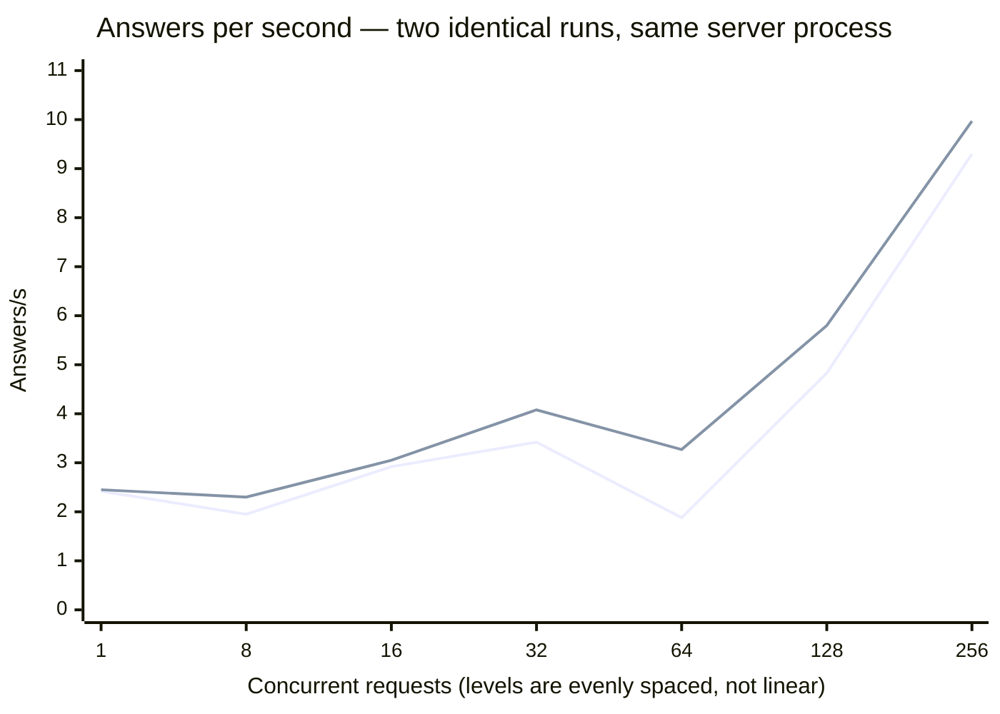

# Scenario: concurrent load — vLLM B12X

The pinned `v1` ladder, run twice, plus one configuration that fails under load.

**Setup:** [vLLM B12X TP=2](../README.md) · `nvidia/DeepSeek-V4-Flash-NVFP4` ·
[cloudscale `GPU2-512-80-4-800`](../../../README.md) · measured 2026-08-17

## Method

Protocol `v1` unchanged: `max_tokens` 512, levels 1/8/16/32/64/128/256, 40 s per level,
3 discarded warmups, counted via `usage`, the pinned English prompt (~1216 tokens). No
`--levels` override. The prompt-mix block at concurrency 32 is part of the protocol.

Two cards (0 and 1) served the model at `--tensor-parallel-size 2`; cards 2 and 3 were
not part of the deployment. The full ladder was run twice back to back against the same
server process, with no restart between runs, to separate the shape of the curve from
run-to-run noise.

## Throughput

**Run 1**

| Concurrent | Answers/s | Output tok/s | Total tok/s | Latency p50 | p95 | GPU |
|---|---|---|---|---|---|---|
| 1 | 2.42 | 96.5 | 3040.5 | 0.41 s | 0.51 s | 85 % · 80 % |
| 8 | 1.95 | 80.4 | 2447.7 | 4.20 s | 7.14 s | 29 % · 50 % |
| 16 | 2.92 | 120.6 | 3671.6 | 5.70 s | 8.15 s | 59 % · 36 % |
| 32 | 3.42 | 138.6 | 4296.6 | 9.56 s | 16.57 s | 42 % · 66 % |
| 64 | 1.88 | 74.7 | 2350.9 | 46.09 s | 46.57 s | 18 % · 16 % |
| 128 | 4.83 | 198.3 | 6055.9 | 29.32 s | 49.93 s | 55 % · 25 % |
| 256 | 9.30 | 382.1 | 11672.2 | 43.87 s | 61.90 s | 74 % · 34 % |

**Run 2**

| Concurrent | Answers/s | Output tok/s | Total tok/s | Latency p50 | p95 | GPU |
|---|---|---|---|---|---|---|
| 1 | 2.45 | 98.7 | 3073.0 | 0.41 s | 0.52 s | 81 % · 81 % |
| 8 | 2.30 | 93.6 | 2885.8 | 3.56 s | 4.96 s | 58 % · 41 % |
| 16 | 3.05 | 120.7 | 3823.4 | 5.42 s | 7.86 s | 71 % · 34 % |
| 32 | 4.08 | 164.7 | 5111.7 | 8.35 s | 11.55 s | 85 % · 37 % |
| 64 | 3.27 | 133.4 | 4109.2 | 20.37 s | 36.98 s | 48 % · 24 % |
| 128 | 5.80 | 236.8 | 7278.0 | 25.17 s | 41.90 s | 68 % · 33 % |
| 256 | **9.97** | **403.6** | **12513.3** | 42.54 s | 55.85 s | 83 % · 37 % |



## Prompt mix at concurrency 32

| Run | Traffic | Answers/s | Output tok/s | Total tok/s | p50 | p95 |
|---|---|---|---|---|---|---|
| 1 | uniform | 4.15 | 174.2 | 5212.3 | 8.15 s | 10.98 s |
| 1 | mixed | 1.88 | 685.5 | 2412.9 | 20.63 s | 33.47 s |
| 2 | uniform | 4.25 | 171.2 | 5330.7 | 8.00 s | 11.40 s |
| 2 | mixed | 1.57 | 573.0 | 1923.3 | 21.86 s | 41.03 s |

## Reading

**The curve is not monotone, and the dip sits exactly at `--max-num-seqs 64`.** Both runs
lose throughput going from 32 to 64 concurrent requests — 3.42 → 1.88 and 4.08 → 3.27 —
then recover at 128 and 256. A request ceiling that coincides with the level where
throughput falls is the obvious suspect: at 64 the scheduler is holding its maximum
running set and has no free slot to admit a prefill chunk alongside decode, so prefill
and decode alternate instead of overlapping. Above 64 the surplus requests queue outside
the engine, the running set stays full, and the interleaving settles down again.
**Untested** — the flag was not varied, so this is the reading of the shape, not a
measured cause.

**Run-to-run spread is far too large to tune against.**

| Concurrent | Run 1 | Run 2 | Spread |
|---|---|---|---|
| 1 | 2.42 | 2.45 | 1 % |
| 8 | 1.95 | 2.30 | 18 % |
| 16 | 2.92 | 3.05 | 4 % |
| 32 | 3.42 | 4.08 | 19 % |
| **64** | **1.88** | **3.27** | **74 %** |
| 128 | 4.83 | 5.80 | 20 % |
| 256 | 9.30 | 9.97 | 7 % |

The ends of the ladder are stable to within a few percent; the middle is not. For
comparison, the [SGLang stack on this machine](../../../deepseek-v4-flash-0731/sglang/scenarios/concurrent-load.md#configuration-sweep-protocol-v1)
measured a 6 % spread at concurrency 128. Any conclusion drawn from a single 40 s window
in the 8–128 range on this stack is noise.

**Neither card is saturated at any level, and the two do not track each other.** Peak
observed utilisation is 87 %, and the pair diverges by up to a factor of two — 85/37 % at
concurrency 32 in run 2. Which card leads is not stable either: run 2 has card 0 ahead at
every level above 1, run 1 alternates. With `--tensor-parallel-size 2` both cards run the
same layers on split tensors and should move together, so the asymmetry points at
scheduling or collective wait time rather than at load imbalance.

**Two cards here reach 86 % of what four cards reach on the older release.** SGLang
serving `DeepSeek-V4-Flash-0731` peaks at 11.30 req/s at concurrency 256 on all four
cards; this stack reaches 9.97 on two, or **1.76× the requests per card**. The comparison
is worth stating and not worth over-reading: it is a different checkpoint release, a
different quantisation and a different engine, so it does not say vLLM beats SGLang — it
says this checkpoint on this kit gets useful throughput out of half the machine. The
[cross-setup caveats](../../README.md#what-this-is-not-comparable-to) spell out why.

**A realistic prompt mix costs 55–63 % of the answers per second.** 4.15 → 1.88 and
4.25 → 1.57. That is the largest mix penalty measured on this machine; the two Gemma runs
lose 18 % or less. Total tokens per second falls with it while *output* tokens per second
rises sharply (171 → 573), which is the mix doing what it is designed to do: fewer, longer
answers over shorter prompts.

## `--max-num-batched-tokens 512` fails at concurrency 16

Run as a configuration comparison, because the smaller batch budget buys a 56 % larger KV
pool ([why](../README.md#the-kv-pool-is-set-by-the-batch-budget-not-by-vram)). It
does not survive the ladder:

| Concurrent | Answers/s | Output tok/s | Total tok/s | p50 | p95 | GPU |
|---|---|---|---|---|---|---|
| 1 | 2.58 | 93.2 | 3219.2 | 0.38 s | 0.45 s | 76 % · 87 % |
| 8 | 2.27 | 85.1 | 2847.0 | 3.54 s | 5.29 s | 38 % · 56 % |
| 16 | **failed** | | | | | |
| 32 | **failed** | | | | | |
| 64 | **failed** | | | | | |
| 128 | **failed** | | | | | |
| 256 | **failed** | | | | | |

The engine died at concurrency 16 and every later level returned HTTP 500 against a dead
process. The container exited with status 0 — nothing in `docker ps` output suggests a
crash, which is why this needs the log:

```
RuntimeError: Worker failed with error 'Workspace is locked but allocation from
'b12x.py:274:_run_compressed_mla' requires 215.49 MB, current size is 204.82 MB.
vllm.v1.engine.exceptions.EngineDeadError: EngineCore encountered an issue.
```

The scheduler dump at the moment of death shows `num_running_reqs=16`, a batch of 14
decode requests at 3 tokens each (one token plus two speculative) and one 190-token
prefill chunk — an ordinary mixed batch, not an outlier.

**The B12X compressed-MLA kernel sizes and locks its workspace once, from
`--max-num-batched-tokens`.** At 512 that lock is 204.82 MB, and the kernel's own
requirement crosses it between 8 and 16 concurrent requests. The failure is therefore a
property of the flag combination, not of load in general: single-stream and concurrency 8
are unaffected, and at `--max-num-batched-tokens 2048` the full ladder to 256 completes
twice without incident.

The kit documents this configuration as
`MNBT=512 MAXLEN=1048576` for long context and marks it "capacity-verified; **load-tested
only on short prompts**". This is what load-testing it finds.

## Not measured

- `--max-num-seqs` above 64. It is the leading explanation for both the dip at 64 and the
  unsaturated cards, and varying it is the one experiment that would turn the reading
  above into a finding. Each attempt costs an 18-minute restart
- Whether a value between 512 and 2048 keeps the larger KV pool without crossing the
  workspace lock. Only the two endpoints were run
- Concurrency above 256, and sustained load beyond the 40 s window at any level
- A third run of the ladder. Two runs establish that the middle of the curve is noisy;
  they do not pin down its true shape
